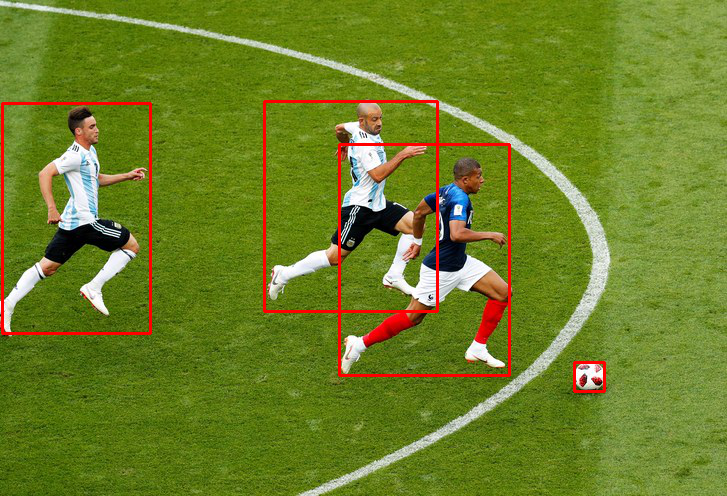

# 训练yolov3
1. 构建数据集
根据下载的数据集进行修改`/yolo3/build_dataset/`里对应的数据集地址
```python
    python ./yolo3/build_dataset/football.py # 构建football数据集
    python ./yolo3/build_dataset/voc2012.py # 构建voc2012数据集
```
2. 直接进行训练
```python
    python yolov3_train.py
```
# 测试yolov3
(现成的模型:https://pan.baidu.com/s/17l0PNIQgtjTT4ba9L_9AiQ 下载后放到`_checkpoints/yolov3/{}/`文件夹下)
1. 修改`yolov3_test.py`里的`image_path`的值来选择图片进行测试
2. 直接进行测试
```python
    python yolov3_test.py
```
# 进行足球视频分析
1. 修改`analysis_video.py`里的`video_path`的值来选择视频进行分析
2. 直接进行测试
```python
    python analysis_video.py
```
todo:
1. 重构deep sort，并且训练出模型

结果:


视频: `_results/output.avi`

参考:
1. https://github.com/qqwweee/keras-yolo3  提供了yolo3的实现方式
2. https://github.com/nwojke/deep_sort 提供了deep sort的实现方式
3. https://github.com/Qidian213/deep_sort_yolov3 提供调用摄像头来实时检测(用现成的yolo3和deep sort模型)

